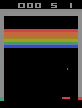

## Implemented Algorithms ##
- [DQN](https://arxiv.org/abs/1312.5602)
- [PPO](https://arxiv.org/abs/1707.06347)
- [DDPG](https://arxiv.org/abs/1509.02971)

## Results ##

### Lunar Lander (DQN, PPO, DDPG) ###
#### Reward Curves ####
| Algorithm         | Reward                                                                                                                                                                   |  
|-------------------|--------------------------------------------------------------------------------------------------------------------------------------------------------------------------|
| DQN               |                                                                                    |    
| PPO               |   |   
| DDPG (Continuous) |                                                                                  |   

#### Training Video ####
  

### Atari Pong (DQN, PPO) ###
#### Reward Curves ####
| Algorithm         | Reward                                                                       |
|-------------------|------------------------------------------------------------------------------|
| DQN               |  |
| PPO               |         |

#### Training video ####
| Step 0                                             | Step 900 000                                            | Step 1 500 000 (final)                                   |
|----------------------------------------------------|---------------------------------------------------------|----------------------------------------------------------|
|  |  |    | 

### Atari Breakout (PPO) ###
| Step 0                                             | Step 900 000                                                 | Step 1 500 000 (final)                                   |
|----------------------------------------------------|--------------------------------------------------------------|----------------------------------------------------------|
|  |  |    |
